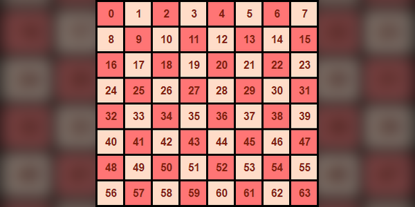
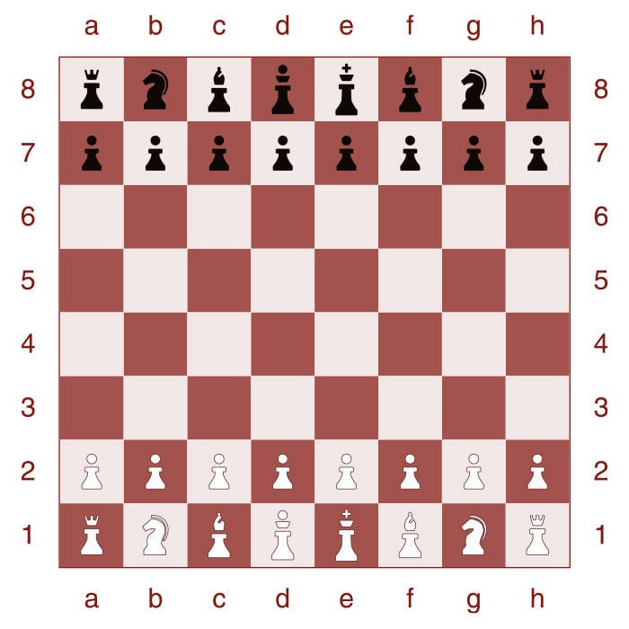

# Codebase Primer
The intention of this documentation is provide an overview of how the codebase is layed out and operates. Reading this should provide you with a general feel on how the engine operates.

The codebase has a simple layout wherein source files are in the `src` directory, header files in `include`, and object files in `obj`. The repository makes use of various branches. The `staging` branch is used for changes that are still being tested before they are deemed fit to be merged with main. 

As the project progresses branches will be created for different iterations of the engine. The first of these branches will simply be an AI which produces moves randomly. With each subsequent major iteration having its own branch that will remain unchanged. 

This use of branches will make it easy for benchmarking and comparing the performance of different iterations against each other.

## Piece Representation

The pieces are represented using a `uint8_t`. Bits zero through three represent the piece type.
|Value | Piece|
|-----|-------|
`000` | Empty
`001` | Pawn
`010` | Knight
`011` | Bishop
`100` | Rook
`101` | Queen
`110` | King
`111` | Undefined

The fourth bit indicates the piece colour.
|Value|Colour|
|-----|------|
|`0XXX`|Black|
|`1XXX`|White|

The remaining four bits could potentially be used to indicate if en-passant is available and if the king has moved, the rook has moved etc.

There is a macro defined in `chess.h` which is used to calculate the colour of a piece. If positive, the piece is white and if zero the piece is black. This is calculated through simply checking if the fourth bit is set using a bitmask.
```C
#define COLOUR(piece) ((piece >> 3) & 1)
```

## Board Representation
### The Board Data Structure
The board is simply represented by an array of 64 `uint8_t`. With each value byte representing a piece. The following images show the indicies of the pieces and the initial board state.



The board is initialised in `main.c`:
```C
uint8_t* board = fenToArray("rnbqkbnr/pppppppp/8/8/8/8/PPPPPPPP/RNBQKBNR");
```
The board is allocated memory on the heap from the following call to malloc in the `fenToArray` function:
```C
uint8_t* board = (uint8_t*)malloc(64 * sizeof(uint8_t));
```

### Piece Orientation and Directions
Piece orientation is important for pawn moves as black pawns will move in the positive direction and white pawns will move in the negative direction. Therefore, the codebase makes use of directions relative to the colour of the pawn. Anterior is forward, posterior is backwards, dextral is right and sinistral is left. The directions are shown below and defined in `chess.h`:
```C
#define ANTERIOR_SQUARE(squareIndex, direction) (squareIndex + direction * 8)
#define SINISTRAL_SQAURE(squareIndex, direction) (squareIndex + direction)
#define DEXTRAL_SQUARE(squareIndex, direction) (squareIndex - direction)
#define POSTERIOR_SQUARE(squareIndex, direction) (squareIndex - direction * 8)
#define WHITE_DIRECTION (-1)
#define BLACK_DIRECTION (1)
```

Macros are employed to calculate these positions given an index and direction. With the direction being either 1 for the black facing direction or -1 for the white facing direction.

### Files and Ranks
The files run vertically and the ranks run horizontally. There are some macros defined in `chess.h` that calculate the rank and file given an index. These macros are shown below:
```C
#define FILE(i) (((i) % 8) + 1)
#define RANK(i) (abs(((i) + 1 + 8 - 1) / 8 - 9))
```

Understanding these calculations is made much easier when referring to the `board_indices.png` image. The A file is represented by 1 and the first rank is represented by 1 also. Then it is easy to see why the calculation for the file is simply the index modulo 8, plus 1.

The calculation for rank is a bit more tricky. I forgot how I came up with it but I'm sure you can figure it out by looking at it.

## Graphics
The graphics for this program is driven by SDL2. Documentation for this library can be found here: https://www.libsdl.org/.

SDL2 uses a left-handed coordinate system, meaning that (0, 0) refers to the pixel at the top-left corner of the screen. Moving to (1, 0) places you one pixel to the right, while (0, 1) moves you one pixel down.

### Sprites
The piece images are shown in the following sprite sheet under the `assets/pieces` directory.


Each piece is 20x20 pixels. Most of the UI functionality is defined in `draw.c`. The main data structures for drawing the board and pieces are:
```C
SDL_Rect* squaresRects[64];
SDL_Rect* piecesRects[12];
SDL_Texture* piecesTexture;
```

The `SDL_Rect` struct defines a rectangular area in which sprites are printed to the screen. Therefore, we define 64 rects; one for each square. We also define 12 rects; one for each piece/colour combination. These 12 rects will be assigned to each piece in the spritesheet within `piecesRects`. This will allow us to use these rects as a source to copy from with the destination being defined in `squaresRects`.

The drawing is enabled through calling various SDL2 functions which is fairly simple.

### The Screen
The screen is simply just the board in a 800x800 pixel window. This means that each piece is upscaled from 20x20 pixels by 5 to 100x100 pixels.

## Forsyth–Edwards Notation (FEN)
This notation is used to describe the state of the board and castling availability as well as a possible En passant target square. The half move, full move count as well as the active colour is also described. More can be read about FEN here: https://en.wikipedia.org/wiki/Forsyth%E2%80%93Edwards_Notation.

The initial state of the board is given by the following FEN string:
`rnbqkbnr/pppppppp/8/8/8/8/PPPPPPPP/RNBQKBNR w KQkq - 0 1`

As you can see, each integer simply represents a run of empty squares. White pieces are denoted using uppercase and black pieces lowercase.

`uint8_t* fenToArray(char* fen)` within `fen.c` takes a FEN string, allocates 64 bytes of memory on the heap, fills allocation with the required piece values, and returns a pointer to it. 

## Move Generation
The move generation functionality is implemented in moves.c. To generate moves for a given piece, the naive approach is to first calculate all potential target squares for that piece. Next, we simulate the move and calculate the target squares of all opposing pieces. If the opposing pieces can attack the king in this scenario, the move is marked as illegal and removed from the list of target squares. By repeating this process for all target squares, we obtain the final set of legal moves for that piece.

This approach is rather inefficient and is subject to change. However, it is important in such a project that we do not prematurely optimise everything. It is more important that we first get the program functional and then perform iterations over time.

The move generation is handled by the `uint64_t getMoves(uint8_t* board, uint8_t pieceIndex)` function in `moves.c`. This function will call a helper function that is associated with each piece type to generate the moves. For example, the call getMoves(board, 25) will lookup the piece at the 25th index in board and if it is a pawn, will then call `pawnTargetSquares`. 

It should be noted that some of the move generation code is rather cryptic. However, if you go through it and constantly refer to the board indices image, things become more clear.

### Target Squares 
A piece's "target squares" are all the squares it can attack, excluding those occupied by pieces of the same color. These target squares are represented using a `uint64_t`, a 64-bit unsigned integer. This is ideal because each bit in the integer corresponds to a specific square on the board, indicating whether it is under attack. This representation also allows easy calculation of all squares attacked by a player’s pieces by combining individual target squares with bitwise OR operations. 

The `getMoves` function will simply return by value an `uint64_t` which represents a given pieces target squares. 